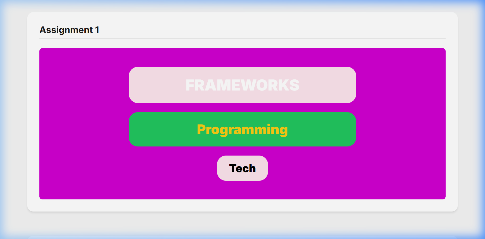
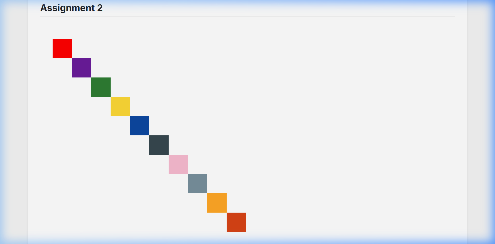
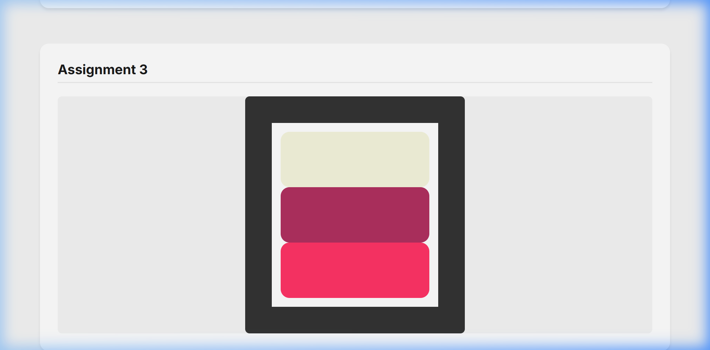
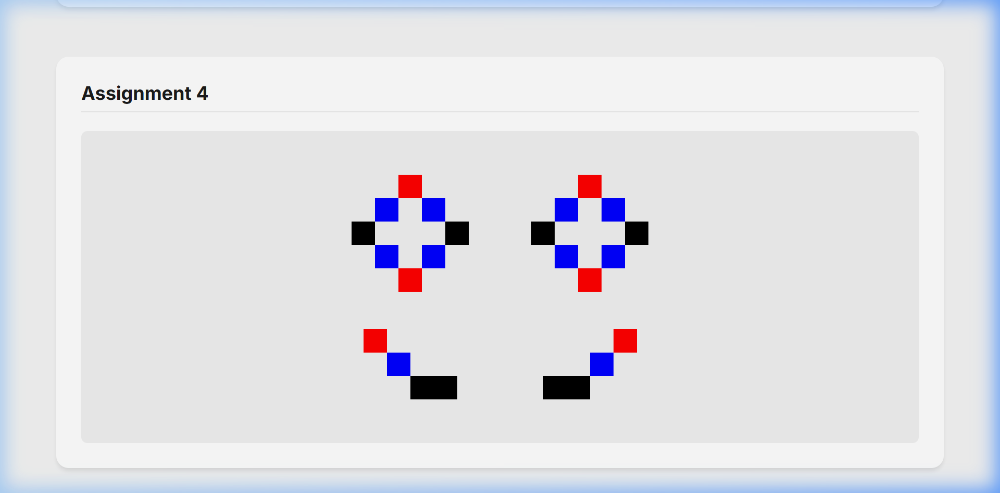

# 3MTT Software Development - UI Recreation Assignments

This repository contains my solutions for the 3MTT Software Development UI recreation assignments. Each assignment focuses on different aspects of CSS layout and styling, ranging from button styling to complex grid and flexbox patterns.

## Assignments Overview

### Assignment 1: Button Frameworks & Styling
A recreation of a vibrant UI section featuring various buttons with distinct typography and color schemes.

### Assignment 2: Diagonal Square Grid
A technical implementation of a diagonal grid pattern using CSS Grid, showcasing precise positioning of multiple colored squares.

### Assignment 3: Color Block Frames
A layout exercise involving nested frames and rounded color blocks, focusing on spacing and alignment.

### Assignment 4: Complex Diamond Patterns
A sophisticated recreation of symmetrical diamond grids and tail patterns, demonstrating advanced CSS Grid and Flexbox techniques.

## Tech Stack
- **HTML5**: Semantic structure.
- **CSS3**: Layout (Grid & Flexbox), Custom Properties (Variables), and Typography.
- **Google Fonts**: Inter font family.

## How to View
Simply open the `index.html` file in any modern web browser to view the assignments.
